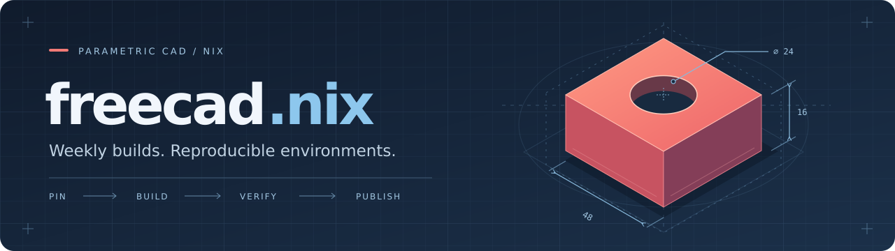

FreeCAD weekly builds and nineteen extensions, packaged for Nix. Pin your CAD environment,
choose your workbenches, and follow a weekly channel that publishes only after its build
and tests pass.

[](#installation)
[](#platform-support)
[](LICENSE)

[Packages](#available-packages) · [Installation](#installation) · [Weekly channel](#weekly-channel) · [Development](#development)

> **Getting started locally:** `nix run .#freecad-weekly`.
> The rolling `weekly` branch and its binary cache become available after the
> [publishing workflow is configured and completes its first run](docs/weekly-channel.md).

## Available packages

### FreeCAD builds

| Package | What it provides |
| --- | --- |
| `freecad-weekly` | An upstream weekly snapshot with the fixes needed to build and run on Nix. The automatic channel updates this package. |
| `freecad-unstable` | An independently pinned weekly with the custom title bar from [FreeCAD#26766](https://github.com/FreeCAD/FreeCAD/pull/26766) and tabs moved to the top. |
| `stepz` | A Python module for importing the ZIP-compressed `.stpZ` models shipped by nixpkgs' KiCad packages. |

The two FreeCAD builds share their build fixes and runtime tests. Their pins are separate,
so a visual patch that needs adapting does not hold back `freecad-weekly`.

### Extensions

Sixteen extensions come from FreeCAD's addon catalogue; three are packaged directly.
Each has a pinned source, content hash and licence, plus a check of the module entry point.
Expand an entry for its version, upstream project and usage command.

<!-- BEGIN GENERATED EXTENSIONS -->

### Modelling

<details>
<summary><strong>curves</strong> — A collection of tools mainly dedicated to NURBS curves and surfaces modeling.</summary>

- **Source**: FreeCAD's catalogue
- **Version**: 0.6.75
- **Licence**: LGPL-2.1-or-later
- **Homepage**: https://github.com/tomate44/CurvesWB
- **Use**: `nix run github:aldoborrero/freecad.nix#freecad-weekly -- --module-path "$(nix build --no-link --print-out-paths github:aldoborrero/freecad.nix#curves)"`
- **Nix**: [nix/packages/curves.nix](nix/packages/curves.nix)

</details>

<details>
<summary><strong>dynamicdata</strong> — Container object for holding custom properties, alternative to spreadsheet</summary>

- **Source**: FreeCAD's catalogue
- **Version**: 2.78
- **Licence**: LGPL-2.1-or-later
- **Homepage**: https://github.com/mwganson/DynamicData
- **Use**: `nix run github:aldoborrero/freecad.nix#freecad-weekly -- --module-path "$(nix build --no-link --print-out-paths github:aldoborrero/freecad.nix#dynamicdata)"`
- **Nix**: [nix/packages/dynamicdata.nix](nix/packages/dynamicdata.nix)

</details>

<details>
<summary><strong>lattice2</strong> — Tools and arrays of all sorts and kinds, and local coordinate systems</summary>

- **Source**: FreeCAD's catalogue
- **Version**: 1.1
- **Licence**: LGPL-2.0-or-later
- **Homepage**: https://github.com/DeepSOIC/Lattice2
- **Use**: `nix run github:aldoborrero/freecad.nix#freecad-weekly -- --module-path "$(nix build --no-link --print-out-paths github:aldoborrero/freecad.nix#lattice2)"`
- **Nix**: [nix/packages/lattice2.nix](nix/packages/lattice2.nix)

</details>

<details>
<summary><strong>meshremodel</strong> — Workbench for remodeling and repairing mesh objects.</summary>

- **Source**: FreeCAD's catalogue
- **Version**: 1.11.0
- **Licence**: LGPL-2.1-or-later
- **Homepage**: https://github.com/mwganson/MeshRemodel
- **Use**: `nix run github:aldoborrero/freecad.nix#freecad-weekly -- --module-path "$(nix build --no-link --print-out-paths github:aldoborrero/freecad.nix#meshremodel)"`
- **Nix**: [nix/packages/meshremodel.nix](nix/packages/meshremodel.nix)

</details>

<details>
<summary><strong>silk</strong> — NURBS Surface modeling tools focused on low degree and seam continuity</summary>

- **Source**: FreeCAD's catalogue
- **Version**: 0.4.0
- **Licence**: GPL-3.0-or-later
- **Homepage**: https://github.com/edwardvmills/Silk
- **Use**: `nix run github:aldoborrero/freecad.nix#freecad-weekly -- --module-path "$(nix build --no-link --print-out-paths github:aldoborrero/freecad.nix#silk)"`
- **Nix**: [nix/packages/silk.nix](nix/packages/silk.nix)

</details>

### Assemblies and mechanical parts

<details>
<summary><strong>fasteners</strong> — Some common fasteners and fastener tools for FreeCAD.</summary>

- **Source**: FreeCAD's catalogue
- **Version**: 0.5.64
- **Licence**: GPL-2.0-or-later
- **Homepage**: https://github.com/shaise/FreeCAD_FastenersWB
- **Use**: `nix run github:aldoborrero/freecad.nix#freecad-weekly -- --module-path "$(nix build --no-link --print-out-paths github:aldoborrero/freecad.nix#fasteners)"`
- **Nix**: [nix/packages/fasteners.nix](nix/packages/fasteners.nix)

</details>

<details>
<summary><strong>freecad-gears</strong> — A gear workbench for FreeCAD</summary>

- **Source**: FreeCAD's catalogue
- **Version**: 1.3
- **Licence**: GPL-3.0-or-later
- **Homepage**: https://github.com/looooo/freecad.gears
- **Use**: `nix run github:aldoborrero/freecad.nix#freecad-weekly -- --module-path "$(nix build --no-link --print-out-paths github:aldoborrero/freecad.nix#freecad-gears)"`
- **Nix**: [nix/packages/freecad-gears.nix](nix/packages/freecad-gears.nix)

</details>

<details>
<summary><strong>sheetmetal</strong> — A simple sheet metal tools workbench for FreeCAD.</summary>

- **Source**: FreeCAD's catalogue
- **Version**: 0.8.21
- **Licence**: LGPL-2.1-or-later
- **Homepage**: https://github.com/shaise/FreeCAD_SheetMetal
- **Use**: `nix run github:aldoborrero/freecad.nix#freecad-weekly -- --module-path "$(nix build --no-link --print-out-paths github:aldoborrero/freecad.nix#sheetmetal)"`
- **Nix**: [nix/packages/sheetmetal.nix](nix/packages/sheetmetal.nix)

</details>

### 3D printing

<details>
<summary><strong>gridfinity</strong> — This Workbench will generate several variations of parametric Gridfinity bins and baseplates that can be easily customized.</summary>

- **Source**: FreeCAD's catalogue
- **Version**: 0.12.4
- **Licence**: LGPL-2.1-or-later
- **Homepage**: https://github.com/Stu142/FreeCAD-Gridfinity-Workbench
- **Use**: `nix run github:aldoborrero/freecad.nix#freecad-weekly -- --module-path "$(nix build --no-link --print-out-paths github:aldoborrero/freecad.nix#gridfinity)"`
- **Nix**: [nix/packages/gridfinity.nix](nix/packages/gridfinity.nix)

</details>

<details>
<summary><strong>slicercad</strong> — FreeCAD addon: printer-bed preview, fit checking, and export to a slicer</summary>

- **Source**: [its own repo](https://github.com/aldoborrero/slicercad)
- **Version**: 0.1.0
- **Licence**: AGPL-3.0-only
- **Homepage**: https://github.com/aldoborrero/slicercad
- **Use**: `nix run github:aldoborrero/freecad.nix#freecad-weekly -- --module-path "$(nix build --no-link --print-out-paths github:aldoborrero/freecad.nix#slicercad)"`
- **Nix**: [nix/packages/slicercad.nix](nix/packages/slicercad.nix)

</details>

### KiCad and electronics

<details>
<summary><strong>free2ki</strong> — Export your 3D models to VRML files, with correctly applied rotation and scaling, for use in KiCad as well as Blender.</summary>

- **Source**: FreeCAD's catalogue
- **Version**: 1.1.2
- **Licence**: GPL-3.0-or-later
- **Homepage**: https://github.com/30350n/free2ki
- **Use**: `nix run github:aldoborrero/freecad.nix#freecad-weekly -- --module-path "$(nix build --no-link --print-out-paths github:aldoborrero/freecad.nix#free2ki)"`
- **Nix**: [nix/packages/free2ki.nix](nix/packages/free2ki.nix)

</details>

<details>
<summary><strong>freecad-pcb</strong> — Printed Circuit Board (PCB) Workbench for FreeCAD</summary>

- **Source**: FreeCAD's catalogue
- **Version**: 6.2023.1
- **Licence**: LGPL-2.0-or-later
- **Homepage**: https://github.com/marmni/FreeCAD-PCB
- **Use**: `nix run github:aldoborrero/freecad.nix#freecad-weekly -- --module-path "$(nix build --no-link --print-out-paths github:aldoborrero/freecad.nix#freecad-pcb)"`
- **Nix**: [nix/packages/freecad-pcb.nix](nix/packages/freecad-pcb.nix)

</details>

<details>
<summary><strong>kicad-stepup</strong> — A bidirectional ECAD/MCAD collaboration between KiCAD and FreeCAD.</summary>

- **Source**: FreeCAD's catalogue
- **Version**: 11.09.5
- **Licence**: AGPL-3.0-only
- **Homepage**: https://github.com/easyw/kicadStepUpMod
- **Use**: `nix run github:aldoborrero/freecad.nix#freecad-weekly -- --module-path "$(nix build --no-link --print-out-paths github:aldoborrero/freecad.nix#kicad-stepup)"`
- **Nix**: [nix/packages/kicad-stepup.nix](nix/packages/kicad-stepup.nix)

</details>

<details>
<summary><strong>kiconnect</strong> — PCB Syncronization with KiCAD v9+</summary>

- **Source**: FreeCAD's catalogue
- **Version**: 1.0.1
- **Licence**: LGPL-2.1-or-later
- **Homepage**: https://codeberg.org/kiconnect/KiConnect
- **Use**: `nix run github:aldoborrero/freecad.nix#freecad-weekly -- --module-path "$(nix build --no-link --print-out-paths github:aldoborrero/freecad.nix#kiconnect)"`
- **Nix**: [nix/packages/kiconnect.nix](nix/packages/kiconnect.nix)

</details>

### Interface

<details>
<summary><strong>color-palette-theme</strong> — Choose your colors with the "ColorPalette" Theme and increase the focus on objects and texts(FreeCAD v1.1.0 ≥)</summary>

- **Source**: FreeCAD's catalogue
- **Version**: 2.3.3
- **Licence**: LGPL-2.1-or-later
- **Homepage**: https://github.com/altangarts/FreeCAD-Themes-ColorPalette
- **Use**: `nix run github:aldoborrero/freecad.nix#freecad-weekly -- --module-path "$(nix build --no-link --print-out-paths github:aldoborrero/freecad.nix#color-palette-theme)"`
- **Nix**: [nix/packages/color-palette-theme.nix](nix/packages/color-palette-theme.nix)

</details>

<details>
<summary><strong>freecad-ribbon</strong> — A Ribbon interface for FreeCAD</summary>

- **Source**: FreeCAD's catalogue
- **Version**: 1.11.3
- **Licence**: GPL-3.0-or-later
- **Homepage**: https://codeberg.org/apebbers/FreeCAD-Ribbon/wiki
- **Use**: `nix run github:aldoborrero/freecad.nix#freecad-weekly -- --module-path "$(nix build --no-link --print-out-paths github:aldoborrero/freecad.nix#freecad-ribbon)"`
- **Nix**: [nix/packages/freecad-ribbon.nix](nix/packages/freecad-ribbon.nix)

</details>

<details>
<summary><strong>freecad-timeline</strong> — FreeCAD addon: a Fusion-style feature timeline docked under the 3D view</summary>

- **Source**: [its own repo](https://github.com/aldoborrero/freecad-timeline)
- **Version**: 1.0.0
- **Licence**: LGPL-2.1-or-later
- **Homepage**: https://github.com/aldoborrero/freecad-timeline
- **Use**: `nix run github:aldoborrero/freecad.nix#freecad-weekly -- --module-path "$(nix build --no-link --print-out-paths github:aldoborrero/freecad.nix#freecad-timeline)/Mod/Timeline"`
- **Nix**: [nix/packages/freecad-timeline.nix](nix/packages/freecad-timeline.nix)

</details>

<details>
<summary><strong>piemenu</strong> — The PieMenu module is a tool to accelerate and simplify your workflow in usage of FreeCAD.</summary>

- **Source**: FreeCAD's catalogue
- **Version**: 1.13
- **Licence**: LGPL-2.1-or-later
- **Homepage**: https://github.com/Grubuntu/PieMenu
- **Use**: `nix run github:aldoborrero/freecad.nix#freecad-weekly -- --module-path "$(nix build --no-link --print-out-paths github:aldoborrero/freecad.nix#piemenu)"`
- **Nix**: [nix/packages/piemenu.nix](nix/packages/piemenu.nix)

</details>

### Automation

<details>
<summary><strong>freecad-mcp</strong> — MCP server for FreeCAD: drives a running FreeCAD over XML-RPC</summary>

- **Source**: [neka-nat](https://github.com/neka-nat/freecad-mcp)
- **Version**: 0.1.21
- **Licence**: MIT
- **Homepage**: https://github.com/neka-nat/freecad-mcp
- **Use**: `nix run github:aldoborrero/freecad.nix#freecad-weekly -- --module-path "$(nix build --no-link --print-out-paths github:aldoborrero/freecad.nix#freecad-mcp)/share/freecad-mcp/FreeCADMCP"`
- **Nix**: [nix/packages/freecad-mcp/default.nix](nix/packages/freecad-mcp/default.nix)

</details>

<!-- END GENERATED EXTENSIONS -->

The catalogue above is generated from package metadata. `nix run .#gen-readme` updates it;
`readme-current` checks it for drift. See [packaging extensions](docs/addons.md) for adding
workbenches, licence decisions and the `stepz` and `freecad-mcp` integration details.

## Installation

### Requirements

Use Nix with flakes enabled. Add the following to your Nix configuration if needed:

```ini
experimental-features = nix-command flakes
```

### Try without installing

From this checkout:

```bash
nix run .#freecad-weekly
```

From the published repository's default branch:

```bash
nix run github:aldoborrero/freecad.nix#freecad-weekly
```

For the visual variant, select `#freecad-unstable`. To install either package in your
user profile, use `nix profile add` instead of `nix run`.

### Load extensions

There is no combined package: select workbenches with `--module-path`. For example:

```bash
nix run .#freecad-weekly -- \
  --module-path "$(nix build --no-link --print-out-paths .#gridfinity)" \
  --module-path "$(nix build --no-link --print-out-paths .#curves)"
```

For Timeline and the MCP workbench, append their module subdirectories:

```bash
nix eval --raw .#freecad-timeline.modulePath   # Mod/Timeline
nix eval --raw .#freecad-mcp.modulePath        # share/freecad-mcp/FreeCADMCP
```

The generated commands above already include these suffixes. Adding an extension to
`environment.systemPackages` alone does not tell FreeCAD to load it; pass its module path
when launching FreeCAD.

### Use as a flake input

Add the input and package to your NixOS flake. Keep your existing host configuration in
`configuration.nix`:

```nix
{
  inputs = {
    nixpkgs.url = "github:NixOS/nixpkgs/nixos-unstable";
    freecad-nix.url = "github:aldoborrero/freecad.nix";
  };

  outputs = { nixpkgs, freecad-nix, ... }: {
    nixosConfigurations.workstation = nixpkgs.lib.nixosSystem {
      system = "x86_64-linux";
      modules = [
        ./configuration.nix
        {
          environment.systemPackages = [
            freecad-nix.packages.x86_64-linux.freecad-weekly
          ];
        }
      ];
    };
  };
}
```

Once the weekly channel is published, use
`github:aldoborrero/freecad.nix/weekly` as the input URL. Your consuming flake remains
pinned until you run `nix flake update freecad-nix`.

The packages use this project's locked nixpkgs. Keeping that input independent preserves
the dependency set tested here and enables cache reuse. `lib.mkAddon` is also exported
for consumers that want to package an extension from the same catalogue lock.

### Binary cache

The publisher supports signed native Nix caches through `nix copy`. A public cache URL
and signing key have not been configured yet; expect local compilation until they are.

Once available, add the published URL to `extra-substituters` and the public key to
`extra-trusted-public-keys` in your Nix configuration. Maintainers can follow the
[cache and runner setup](docs/weekly-channel.md#enable-it).

## Weekly channel

The [FreeCAD weekly workflow](.github/workflows/weekly.yml) polls upstream every six
hours. Each candidate goes through:

1. Select the newest dated FreeCAD weekly and fetch its source hash.
2. Check patches, generated documentation, formatting and automation tests.
3. Compile FreeCAD, verify its version and run its runtime tests.
4. Sign and upload the package outputs and their dependencies to the configured cache.
5. Atomically publish the `weekly` branch and an immutable version tag.

An unchanged weekly and packaging revision are skipped. If a build, test or upload fails,
the previously published channel remains available. The workflow updates only the
`freecad-weekly` pin; it does not merge into the default branch or update `flake.lock`.

After the first successful publication:

```bash
nix run github:aldoborrero/freecad.nix/weekly#freecad-weekly
```

Use a published `weekly-<date>-<system>-<recipe>` tag to retain or return to a particular
build. GitHub may delay scheduled runs, and an upstream snapshot can fail to build:
`weekly` means the latest successfully validated snapshot, not a guarantee that every
upstream release has been published.

[Set up or troubleshoot the weekly publisher →](docs/weekly-channel.md)

## Platform support

| System | Package outputs | Validation and publication |
| --- | --- | --- |
| `x86_64-linux` | Available | Locally compiled and tested; default publishing target. |
| `aarch64-linux` | Available | Evaluated locally; compilation needs a native ARM runner. |

The workflow publishes one architecture per channel. The flake currently targets Linux;
macOS and Windows packages are not provided.

## Development

```bash
nix develop
nix build .#freecad-weekly
nix build .#checks.x86_64-linux.weekly-patches
nix run .#gen-readme
nix fmt
nix flake check
```

The full check includes both FreeCAD builds. For focused changes, build the affected
package or check first. The development shell supplies the pinned automation and
formatting tools.

- [Development and update routes](docs/development.md)
- [Packaging extensions and resolving licences](docs/addons.md)
- [Repository conventions](AGENTS.md)

## Contributing

Contributions are welcome. Keep package versions, hashes and metadata together, regenerate
the extension list when it changes, and run `nix fmt` and `nix flake check` before sending
a pull request. Dependency updates open pull requests; nothing auto-merges.

## Acknowledgements

- [FreeCAD](https://github.com/FreeCAD/FreeCAD) and its workbench authors provide the CAD
  application and extensions packaged here.
- [numtide/llm-agents.nix](https://github.com/numtide/llm-agents.nix) inspired this README's
  banner, generated package catalogue and installation layout.
- [Blueprint](https://github.com/numtide/blueprint) maps the Nix directory structure to
  flake outputs.

## License

The packaging and original project artwork are licensed under [MIT](LICENSE).
FreeCAD and its extensions retain their own licences; see the package metadata above.
